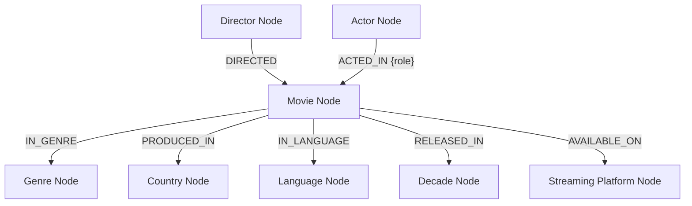
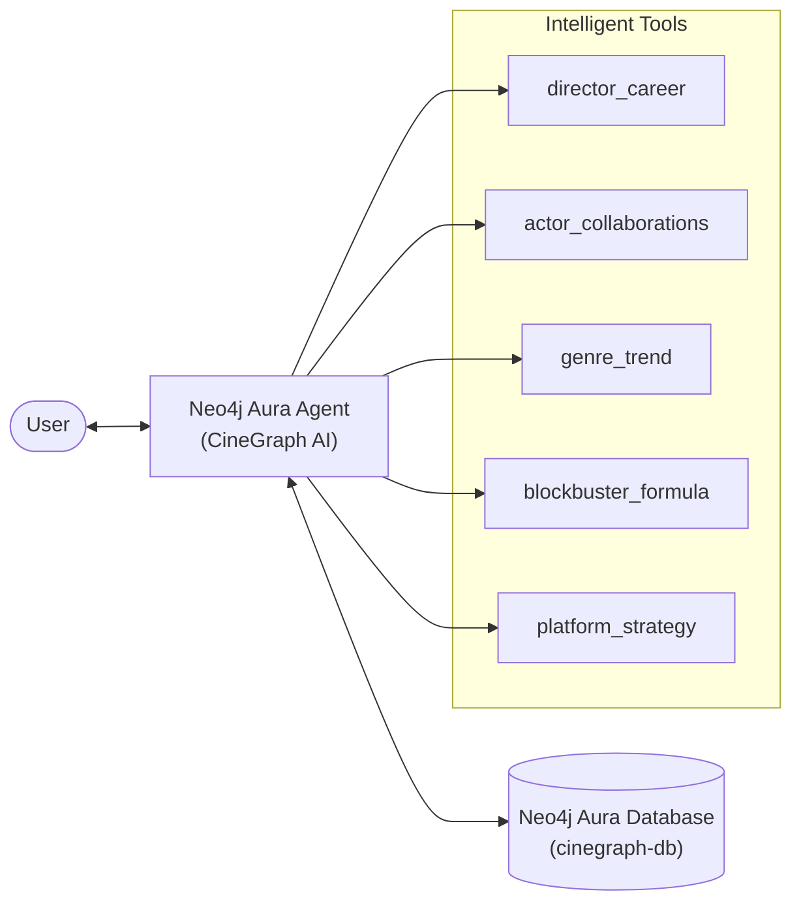

# CineGraph AI — Aura Agent Configuration Guide

Complete copy-paste guide for configuring your agent in the **Neo4j Aura Console**.

---

## 1. System Prompt

Paste this into the **System Prompt** field when creating your agent:

```
You are CineGraph AI, a global cinema intelligence agent powered by a knowledge graph of 100,000 movies spanning 1950-2026. You reason over rich relationships between movies, directors, actors, genres, countries, decades, and streaming platforms to surface insights that go beyond simple data lookups.

Your knowledge graph contains:
- 100,000 Movie nodes with ratings, financials (budget, revenue, ROI), awards, and popularity data
- Directors, Actors (lead actor + lead actress), Genres (multi-genre per movie), Countries, Languages, Decades, and Streaming Platforms as connected entity nodes
- Over 400,000 relationships connecting these entities

When answering questions:
1. Always trace the graph relationships that produced your answer — cite the traversal path
2. Provide specific numbers: ratings, ROI percentages, award counts, revenue figures
3. Explain WHY patterns exist using multi-hop reasoning (e.g., Director→Movie→Genre + Movie→Country)
4. Compare across dimensions (decades, genres, countries, platforms) when the question benefits from it
5. Surface non-obvious, counterintuitive insights that only graph traversal can reveal
6. When asked about trends, show the evolution across decades

You specialize in:
- Director filmography and career trajectory analysis
- Actor collaboration networks and chemistry tracking
- Genre evolution and cross-genre performance trends
- Financial pattern recognition (ROI, budget-to-revenue, marketing efficiency)
- Award prediction based on graph neighborhood patterns
- Streaming platform content strategy analysis
- Franchise vs. original content performance comparison
- Country/language market analysis for global cinema
```

---

## 2. Cypher Template Tools

Create these tools in the **Tools** section of your agent. Each tool has a **Name**, **Description**, and **Cypher Query**.

---

### Tool 1: Director Career Analysis

**Name:** `director_career`

**Description:** Analyze a director's complete filmography including ratings, revenue, ROI, and awards across their career. Use this when the user asks about a specific director's movies, career, performance, or filmography.

**Cypher:**
```cypher
MATCH (d:Director {name: $director_name})-[:DIRECTED]->(m:Movie)
OPTIONAL MATCH (m)-[:IN_GENRE]->(g:Genre)
WITH d, m, collect(DISTINCT g.name) AS genres
RETURN m.title AS movie, m.release_year AS year, genres,
       m.imdb_rating AS rating, m.metascore AS metascore,
       m.revenue_million AS revenue_M, m.roi_pct AS roi_pct,
       m.award_nominations AS nominations, m.award_wins AS wins,
       m.blockbuster_flag AS is_blockbuster
ORDER BY m.release_year
LIMIT 50
```

**Parameters:** `director_name` (String) — e.g., "Christopher Nolan", "Steven Spielberg"

---

### Tool 2: Actor Collaboration Network

**Name:** `actor_collaborations`

**Description:** Find which directors an actor has worked with most frequently and how those collaborations performed. Shows collaboration count, average rating, average ROI, and total award wins. Use this when the user asks about an actor's career, partnerships, or collaborations.

**Cypher:**
```cypher
MATCH (a:Actor {name: $actor_name})-[:ACTED_IN]->(m:Movie)<-[:DIRECTED]-(d:Director)
WITH d.name AS director, collect(m) AS movies
WITH director, size(movies) AS collaborations,
     reduce(s = 0.0, m IN movies | s + m.imdb_rating) / size(movies) AS avg_rating,
     reduce(s = 0.0, m IN movies | s + m.roi_pct) / size(movies) AS avg_roi,
     reduce(s = 0, m IN movies | s + m.award_wins) AS total_wins,
     [m IN movies | m.title][..5] AS sample_movies
RETURN director, collaborations, round(avg_rating * 10) / 10 AS avg_rating,
       round(avg_roi * 10) / 10 AS avg_roi, total_wins, sample_movies
ORDER BY collaborations DESC, avg_rating DESC
LIMIT 20
```

**Parameters:** `actor_name` (String) — e.g., "Brad Pitt", "Meryl Streep"

---

### Tool 3: Genre Trend by Decade

**Name:** `genre_decade_trend`

**Description:** Show how a specific genre has performed across all decades (1950s-2020s) in terms of movie count, average rating, ROI, audience scores, blockbusters, and awards. Use this when the user asks about genre trends, evolution, or historical performance.

**Cypher:**
```cypher
MATCH (m:Movie)-[:IN_GENRE]->(g:Genre {name: $genre}),
      (m)-[:RELEASED_IN]->(dec:Decade)
WITH dec.name AS decade,
     count(m) AS movie_count,
     round(avg(m.imdb_rating) * 10) / 10 AS avg_rating,
     round(avg(m.roi_pct) * 10) / 10 AS avg_roi,
     round(avg(m.audience_score) * 10) / 10 AS avg_audience_score,
     sum(CASE WHEN m.blockbuster_flag = 1 THEN 1 ELSE 0 END) AS blockbusters,
     sum(m.award_wins) AS total_wins
RETURN decade, movie_count, avg_rating, avg_roi, avg_audience_score, blockbusters, total_wins
ORDER BY decade
```

**Parameters:** `genre` (String) — e.g., "Sci-Fi", "Drama", "Comedy", "Horror", "Action", "Romance", "Thriller", "Animation", "Documentary", "Fantasy", "Mystery", "Crime", "Adventure"

---

### Tool 4: Director-Genre-Country Deep Dive

**Name:** `director_genre_country`

**Description:** Multi-hop analysis showing how a director performs across different genre-country combinations. Reveals which genre+country pairings produce the best ratings and ROI for a director. Use for deep director analysis or cross-dimensional queries.

**Cypher:**
```cypher
MATCH (d:Director {name: $director_name})-[:DIRECTED]->(m:Movie)-[:IN_GENRE]->(g:Genre),
      (m)-[:PRODUCED_IN]->(c:Country)
WITH g.name AS genre, c.name AS country, collect(m) AS movies
WITH genre, country, size(movies) AS movie_count,
     reduce(s = 0.0, m IN movies | s + m.imdb_rating) / size(movies) AS avg_rating,
     reduce(s = 0.0, m IN movies | s + m.roi_pct) / size(movies) AS avg_roi,
     reduce(s = 0, m IN movies | s + m.award_wins) AS total_awards
RETURN genre, country, movie_count,
       round(avg_rating * 10) / 10 AS avg_rating,
       round(avg_roi * 10) / 10 AS avg_roi, total_awards
ORDER BY avg_rating DESC
LIMIT 25
```

**Parameters:** `director_name` (String)

---

### Tool 5: Blockbuster Formula Finder

**Name:** `blockbuster_formula`

**Description:** Discover which combinations of genre, director, actor, and country produce the most blockbusters in a given time period. Use this when the user asks about blockbuster patterns, success formulas, or what makes a hit movie.

**Cypher:**
```cypher
MATCH (m:Movie)-[:IN_GENRE]->(g:Genre),
      (dir:Director)-[:DIRECTED]->(m),
      (a:Actor)-[:ACTED_IN]->(m),
      (m)-[:PRODUCED_IN]->(c:Country)
WHERE m.blockbuster_flag = 1
  AND m.release_year >= $start_year AND m.release_year <= $end_year
WITH g.name AS genre, dir.name AS director, a.name AS actor, c.name AS country,
     count(DISTINCT m) AS blockbusters,
     round(avg(m.roi_pct) * 10) / 10 AS avg_roi,
     round(avg(m.imdb_rating) * 10) / 10 AS avg_rating
RETURN genre, director, actor, country, blockbusters, avg_roi, avg_rating
ORDER BY blockbusters DESC, avg_roi DESC
LIMIT 20
```

**Parameters:** `start_year` (Integer), `end_year` (Integer)

---

### Tool 6: Streaming Platform Showdown

**Name:** `platform_analysis`

**Description:** Analyze a streaming platform's content library including total movies, average rating, audience score, blockbuster count, awards, and top genres. Use this when the user asks about Netflix, Disney+, HBO Max, or any streaming platform's content strategy.

**Cypher:**
```cypher
MATCH (m:Movie)-[:AVAILABLE_ON]->(sp:StreamingPlatform {name: $platform})
OPTIONAL MATCH (m)-[:IN_GENRE]->(g:Genre)
WITH sp, m, g
WITH sp.name AS platform,
     count(DISTINCT m) AS total_movies,
     round(avg(m.imdb_rating) * 10) / 10 AS avg_rating,
     round(avg(m.audience_score) * 10) / 10 AS avg_audience,
     sum(CASE WHEN m.blockbuster_flag = 1 THEN 1 ELSE 0 END) AS blockbusters,
     sum(m.award_wins) AS total_awards,
     g.name AS genre, count(m) AS genre_count
ORDER BY genre_count DESC
WITH platform, total_movies, avg_rating, avg_audience, blockbusters, total_awards,
     collect(genre)[..5] AS top_genres
RETURN platform, total_movies, avg_rating, avg_audience, blockbusters, total_awards, top_genres
```

**Parameters:** `platform` (String) — e.g., "Netflix", "Prime Video", "Disney+", "HBO Max", "Apple TV+", "Hulu", "Peacock", "Paramount+", "Cinema", "MGM+"

---

### Tool 7 (Optional): Text2Cypher

Enable the **Text2Cypher** tool as a fallback for any ad-hoc natural language query that doesn't match the above templates. This lets the agent generate custom Cypher on-the-fly.

---

## 3. Example Test Conversations

After configuring your agent, test it with these questions:

1. **"Analyze Christopher Nolan's career. What genres does he excel in?"**
   → Uses `director_career` + `director_genre_country`

2. **"Which actor-director pairs have won the most awards together?"**
   → Uses `actor_collaborations`

3. **"How has the Sci-Fi genre evolved from the 1950s to the 2020s?"**
   → Uses `genre_decade_trend`

4. **"What's the formula for a blockbuster in the 2010s?"**
   → Uses `blockbuster_formula` with start_year=2010, end_year=2019

5. **"Compare Netflix vs Disney+ content libraries. Which platform has better rated movies?"**
   → Uses `platform_analysis`

6. **"Brad Pitt's best collaborations — which directors bring out his best?"**
   → Uses `actor_collaborations`

7. **"Which country produces the highest ROI movies in the Horror genre?"**
   → Uses Text2Cypher (ad-hoc query)

---

## 4. Graph Schema Reference

```
Node Labels:
  (:Movie)             — 100,000 nodes, 17 properties
  (:Director)          — ~12 nodes
  (:Actor)             — ~12 nodes
  (:Genre)             — ~13 nodes
  (:Country)           — ~10 nodes
  (:Language)          — ~10 nodes
  (:Decade)            — 8 nodes
  (:StreamingPlatform) — ~12 nodes

Relationships:
  (Director)-[:DIRECTED]->(Movie)
  (Actor)-[:ACTED_IN {role}]->(Movie)
  (Movie)-[:IN_GENRE]->(Genre)
  (Movie)-[:PRODUCED_IN]->(Country)
  (Movie)-[:IN_LANGUAGE]->(Language)
  (Movie)-[:RELEASED_IN]->(Decade)
  (Movie)-[:AVAILABLE_ON]->(StreamingPlatform)
```

---

## 5. Submission Template

Reply to the hackathon thread with this format:

---

### CineGraph AI — Global Cinema Intelligence Agent

**What it does**

CineGraph AI transforms 100,000 movies (1950-2026) into a knowledge graph that reasons about the global film industry. It answers questions no flat database can:
- "Which director-actor pairings consistently produce award-winning blockbusters?"
- "How has the Sci-Fi genre evolved from the 1950s Cold War era to the 2020s AI age?"
- "What genre-country-language combinations yield the highest ROI?"
- "Trace Christopher Nolan's career evolution across genres, countries, and decades"

**Dataset and why a graph fits**

Dataset: Global Movies Dataset from Kaggle (100,000 movies, 27 columns, 1950-2026).

Movies are inherently relational. A table tells you a movie's rating — a graph tells you WHY it succeeded:

```
(Director:Nolan)-[:DIRECTED]->(Movie)-[:IN_GENRE]->(Genre:Sci-Fi)
(Movie)-[:RELEASED_IN]->(Decade:2010s)
(Movie)-[:PRODUCED_IN]->(Country:USA)
(Actor:DiCaprio)-[:ACTED_IN]->(Movie)
```

The question "Why do Nolan's Sci-Fi films outperform his dramas?" requires a 4-hop traversal through Director→Movie→Genre + Movie→Country. A flat database needs 4 JOINs and gives you a number. The graph gives you the reasoning path.

Graph scale: ~115,000 nodes, ~400,000+ relationships.

**Agent tools:**
- 6 Cypher Template tools (director career, actor collaborations, genre trends, director-genre-country deep dive, blockbuster formula, platform analysis)
- Text2Cypher fallback for ad-hoc queries
- All tools demonstrate multi-hop graph reasoning

**Screenshots:** [Attach your screenshots here]

**What makes this different:**
1. **Scale**: 100K movies — one of the largest datasets in the hackathon
2. **Multi-hop reasoning drives every answer** — no simple lookups
3. **Cross-dimensional analysis**: Director × Genre × Country × Decade intersections
4. **Real-world usefulness**: Film industry analysts, streaming platforms, and movie fans would all benefit from this agent
5. **Rich graph modeling**: Pipe-separated genres become separate nodes, enabling genre-crossover analysis (e.g., "Action|Sci-Fi" movies vs pure "Action")

---

## 6. Technical Diagrams & Visuals

Use these diagrams in your submission to explain the project structure.

### Data Model (Graph Schema)


### System Architecture


### Live Graph Visualizations

**Christopher Nolan's Filmography:**


**Actor Collaboration Network (Brad Pitt):**


**Sci-Fi Genre Trends:**


