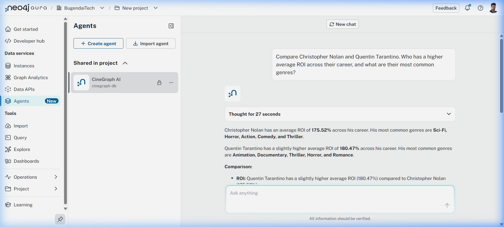

# 🎬 CineGraph AI — Global Cinema Intelligence Agent

CineGraph AI transforms a massive dataset of 100,000 movies (1950–2026) into a high-performance Knowledge Graph. It allows users to perform deep, multi-hop reasoning over the global film industry, uncovering patterns in career trajectories, financial ROI, and genre evolution.

Submitted to the **Neo4j Aura Agent Hackathon 2026**.

## 💡 The Idea

Movie data is typically stored in flat tables (CSV/SQL), where you can see a movie's rating or budget. However, cinema is inherently **relational**. To answer "Why did this director succeed in Sci-Fi but fail in Drama?" or "What actor pairings consistently drive high ROI?", you need to traverse multiple hops through Directors, Actors, Genres, and Financials.

CineGraph AI uses Neo4j Aura to map these connections, enabling an AI Agent to "reason" through the graph neighborhood rather than just performing simple keyword searches.

## 🧠 Why a Graph?

A flat database tells you Christopher Nolan directed *Inception*. A graph tells you that *Inception* (Sci-Fi) released in the *2010s* (Decade) in the *USA* (Country) and achieved a *high ROI*, and then correlates this with every other Sci-Fi film in that decade to determine if Nolan was a trend-setter or a trend-follower.

```cypher
// A typical multi-hop reasoning path
MATCH (d:Director {name: 'Christopher Nolan'})-[:DIRECTED]->(m:Movie)-[:IN_GENRE]->(g:Genre)
MATCH (m)-[:RELEASED_IN]->(dec:Decade)
RETURN g.name, dec.name, avg(m.roi_pct) as avg_roi
ORDER BY avg_roi DESC
```

## 🏗️ Architecture

```text
┌─────────────────┐      ┌──────────────────┐      ┌──────────────────────────┐
│  Global Movies  │      │   Python ETL     │      │   Neo4j Aura Database    │
│  (100K Rows)    │─────>│  (import_movies) │─────>│   (Knowledge Graph)      │
└─────────────────┘      └──────────────────┘      └────────────┬─────────────┘
                                                                │
                                                                ▼
┌─────────────────┐      ┌──────────────────┐      ┌──────────────────────────┐
│   User Query    │<────>│   Aura Agent     │<────>│   6 Cypher Graph Tools   │
│ (Natural Lang)  │      │ (CineGraph AI)   │      │ (Career, Trends, ROI...) │
└─────────────────┘      └──────────────────┘      └──────────────────────────┘
```

## 📂 Project Structure

```text
C:.
│   .env                # Local credentials (ignored by git)
│   .gitignore          # Git exclusion rules
│   AGENT_CONFIG.md     # Full guide for Aura Agent setup
│   app.py              # Streamlit Dashboard (Visual Explorer)
│   import_movies.py    # Python pipeline for data ingestion
│   README.md           # Project documentation
│   requirements.txt    # Python dependencies
│   agent_chat_demo.png # Screenshot of agent reasoning
```

## 🛠️ Intelligent Tools (Aura Agent)

The agent is equipped with 6 custom Cypher Template tools for advanced analysis:
1. **Director Career Analysis**: Complete filmography, revenue tracking, and award wins.
2. **Actor Collaboration Network**: Multi-hop discovery of frequent partnerships and their performance.
3. **Genre Trend by Decade**: Historical performance of genres from 1950s to 2020s.
4. **Director-Genre-Country Deep Dive**: Geographic and stylistic focus analysis.
5. **Blockbuster Formula Finder**: Pattern recognition for high-revenue hits.
6. **Platform Showdown**: Content strategy analysis for Netflix, Disney+, etc.

## 📸 Agent in Action



## 🚀 Quick Start

1. **Clone & Install**:
   ```bash
   git clone https://github.com/Kumar3421/CineGraph-AI.git
   cd CineGraph-AI
   pip install -r requirements.txt
   ```
2. **Ingest Data**:
   Configure `.env` with your Aura credentials and run:
   ```bash
   python import_movies.py
   ```
3. **Configure Agent**:
   Follow the steps in [AGENT_CONFIG.md](AGENT_CONFIG.md) to create your Aura Agent.

---
Built for the **Neo4j Aura Agent Hackathon 2026**.
